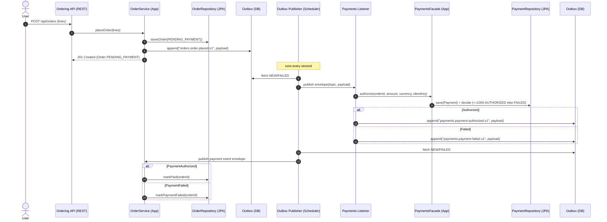

# Book Store — DDD + Hexagonal (Spring Boot)

A backend-only Book Store implemented with **Domain-Driven Design (DDD)** and **Hexagonal Architecture**.  
Built for extension: new bounded contexts (Ordering, Payments, Inventory) and later a web UI (React/Vue/Angular).

---

## Quick start

```bash
# build & run (Java 21, Maven)
mvn spring-boot:run

# create a book
curl -X POST http://localhost:8080/api/catalog/books   -H "Content-Type: application/json"   -d '{ "title":"Clean Architecture", "author":"Robert C. Martin",
        "isbn":"9780134494166",
        "price": { "amount":"34.99", "currency":"EUR" }, "stock": 10 }'

# list books
curl http://localhost:8080/api/catalog/books

# place an order (snapshot price/title)
BOOK_ID=<uuid-from-catalog-response>
curl -X POST http://localhost:8080/api/orders   -H "Content-Type: application/json"   -d "{
        \"lines\":[
          {
            \"bookId\":\"$BOOK_ID\",
            \"title\":\"Clean Architecture\",
            \"currency\":\"EUR\",
            \"unitAmount\":\"34.99\",
            \"quantity\":2
          }
        ]
      }"
```

Expected result:

- If total ≤ 1000.00 → `status: PAID`
- If total > 1000.00 → `status: PAYMENT_FAILED` (demo rule in Payments)

---

## Current bounded contexts

### Catalog
- Aggregate: `Book`
- Value Objects: `Isbn`, `Money`
- Repository: `BookRepository`
- API: `/api/catalog/books`

### Ordering
- Aggregate: `Order` (with `OrderLine`)
- Integrated with Payments asynchronously via Outbox Saga
- API: `/api/orders`

### Payments
- Aggregate: `Payment`
- Simple rule: decline if amount > 1000
- Exposes `PaymentsFacade` (application layer)
- API: `/api/payments/authorize`

---

## Communication between contexts

Currently:

- **Ordering → Payments** uses **async event choreography** with a **Transactional Outbox**.
- Flow:
    - `OrderPlaced` event → Payments consumes → emits `PaymentAuthorized` or `PaymentFailed`.
    - Ordering consumes payment events → updates status.
- **No cross-domain dependencies**: only event contracts are shared, not classes.

This proves the **Ports & Adapters pattern** in action:

- Domain code only depends on abstractions.
- Infrastructure (HTTP, Events, Outbox) can change without touching the domain.

---

## Saga (async) sequence (Mermaid)

The diagram below shows the end-to-end flow from placing an order to payment result using the **Transactional Outbox +
Choreography** pattern.



> Swap `Pub` to Kafka/RabbitMQ by changing the dispatcher—domain/application code stays the same.

---

## Development profile & seed data

The project includes a **dev profile** (`application-dev.yml`) that auto-seeds sample data on startup.

### How it works

- 5 books are registered automatically.
- 2 sample orders are created:
    - One order with total ≤ 1000 → eventually becomes **PAID**
    - One order with total > 1000 → eventually becomes **PAYMENT_FAILED**

### Activate dev profile
`application.yml` is already configured to use `dev` as default.  
Or run manually:
```bash
mvn spring-boot:run -Dspring-boot.run.profiles=dev
```

---

## Inspecting data in H2 console

H2 console: [http://localhost:8080/h2-console](http://localhost:8080/h2-console)  
Connection:

- **JDBC URL**: `jdbc:h2:mem:bookstore`
- **User**: `sa`
- **Password**: (leave empty)

### Useful queries

```sql
SELECT * FROM BOOKS;
SELECT * FROM ORDERS;
SELECT * FROM ORDER_LINES;
SELECT ID, TOPIC, AGGREGATEID, STATUS, ATTEMPTS, CREATEDAT FROM OUTBOX ORDER BY CREATEDAT DESC;
SELECT * FROM PAYMENTS;
```

---

## DDD/Hexagonal rules

- **domain/** → pure business logic (no Spring/JPA annotations)
- **application/** → use-cases, orchestrating domain and ports
- **infrastructure/** → adapters (JPA, HTTP, Outbox, etc.)
- **api/** → REST controllers & DTOs

Bounded contexts are independent and communicate only via **ports** or **events**.

---

## Next milestones

- [ ] Add Inventory context (stock reservation before payment)
- [ ] Add retries + Dead Letter Queue for Outbox
- [ ] Kafka/RabbitMQ dispatcher & consumers (replace in-process publishing)
- [ ] Hardening: Postgres + Flyway, OpenAPI annotations, Dockerfile
- [ ] Frontend app (React/Vue/Angular) consuming the REST API

---

## License

MIT
